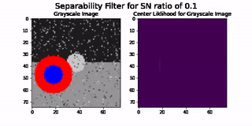

# Circular Separability Filter
> Circle detection in images using Python.




## Installation

```bash
pip install circle_finder # doesn't work yet
```

or using github
```bash
git clone https://github.com/ComputerVisionLaboratory/circle_finder
cd circle_finder
pip install .
```


## Usage

```python
import cv2 as cv
import circle_finder


img = cv.imread('/path/to/image.jpg')
csf = circle_finder.CircularSeparabilityFilter()

circles = csf.find_circles(img, num_circles=1)
print(circles)
> >>[[50, 50]]
```


See more in [tutorials](https://computervisionlaboratory.github.io/circle_finder/Hough_Circle_Comparison.html).
